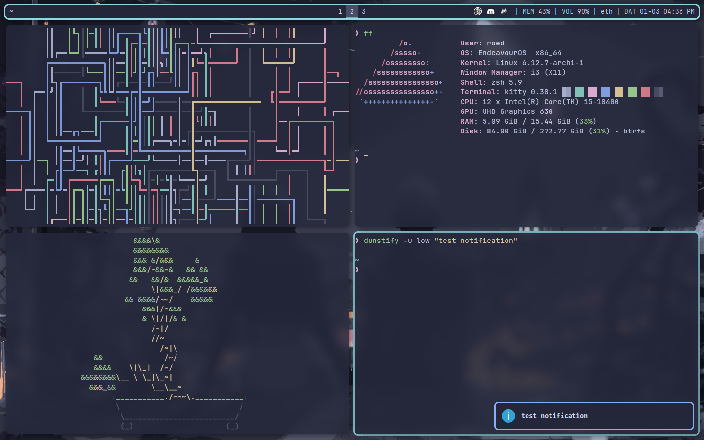

# ⚠️ This repository is currently unmaintained.
As I've been migrating from EndeavourOS to NixOS, this repository is now unmaintained because I'm refactoring my dotfiles to be more nix-friendly. Here's my [nixos-config](https://github.com/rockyroed/nixos-config) repository, if you're interested.

# 🛠️ My Linux Dotfiles

Welcome to my Linux dotfiles repository! This repo contains the configuration files I use to set up and customize my Linux environment. Feel free to explore, fork, and adapt these files to suit your own workflow.

*Links for some of my dotfiles' sources will be added soon.*
